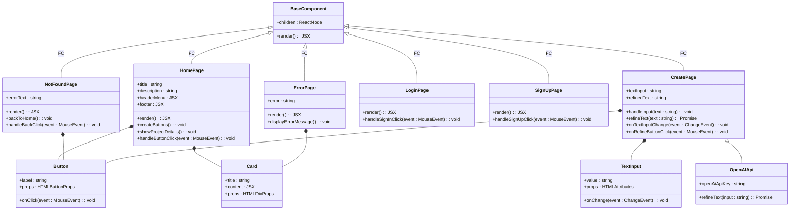

# Trace AI - Note Refining App

## Group Members

- [Nidheesh M Vakharia](https://github.com/yourgithubprofile)
- [Daniel Lee](https://github.com/d-leeee)
- [Ria Maria Mathew](https://github.com/ria0516)
- [Sabrina Piazza](https://github.com/Sabrinapiazza)
- [Maanas Kollegal](https://github.com/MaanasKollegal)

## Project Description

**Trace AI** is a smart note-taking application that helps users refine and organize their notes efficiently. The app allows users to input their rough notes in one window, while an AI-based engine works in another window to clean, format, and summarize the content for better readability and organization. This project combines the power of AI with a user-friendly interface to make the note-taking process more streamlined and effective.

### Why is it important or interesting to you?

Note-taking is a crucial skill for students and professionals alike. However, many people struggle to keep their notes organized or formatted in a way that is easy to review. With **Trace AI**, we aim to make note-taking more efficient by leveraging AI to clean and refine notes automatically, allowing users to focus on the content rather than formatting. The project is particularly interesting because it merges AI technologies with real-world applications in education and productivity. It also provides the team with hands-on experience in working with cutting-edge technologies.

### What languages/tools/technologies do you plan to use?

- **Languages**:

  - TypeScript: Ensures type safety and scalable code.

- **Frameworks**:

  - Next.js: A React-based framework with server-side rendering capabilities. This will enhance the performance of our app and improve SEO. Additionally, Next.js allows easy API creation, which is essential for our AI integration.

- **Authentication**:

  - **Clerk**: Used for user authentication and management. Clerk provides secure access to personal notes and features such as user profiles and saved preferences. It integrates well with Next.js and offers real-time capabilities.

- **Styling**:

  - Tailwind CSS: A utility-first CSS framework that will allow us to build a responsive and modern UI quickly. Its flexibility and built-in utilities will make the design process more efficient.

- **AI**:

  - **OpenAI API**: We chose OpenAI's API for natural language processing because it offers powerful, efficient, and customizable models for text refinement, summarization, and understanding. It’s highly reliable and widely recognized for its capabilities in AI.

- **Project Tools**:
  - GitHub for version control and collaboration.
  - GitHub Projects for task management.

### What will be the input/output of your project?

- **Input**:

  - User’s raw notes, either typed or pasted into the input window.
  - User preferences for how refined they want the output (e.g., summarized, formatted, etc.)

- **Output**:
  - A cleaner, more organized version of the input notes in the output window.

### Features of Trace AI

- Real-time note refinement using AI
- Summarization and keyword extraction
- Customizable formatting options (e.g., headers, bullet points, etc.)
- Authentication and data management using Clerk to secure user notes
- Export options for refined notes (e.g., PDF, Markdown)
- User-friendly interface with two windows: one for input and one for the AI-refined output
- Integration with popular note-taking apps (stretch goal)

## Project Complexity

The complexity of the project is appropriate for the timeline and the team size. We will be building both a user-facing interface and an AI backend, involving the integration of several technologies, including natural language processing models, secure authentication, and front-end frameworks. Each team member will be responsible for different components (e.g., frontend, backend, AI model integration), ensuring a balanced workload.

---

## Project Workflow

Every issue or task in Trace AI will pass through the following stages before deployment:

1. **Backlog**: All planned features and tasks start here. This includes ideas, suggestions, and features that are not yet prioritized for immediate work.
2. **Sprint Backlog**: Features and tasks selected for the current sprint are moved here. These are the tasks that the team has committed to work on during the sprint cycle.
3. **In Development**: Active development occurs in this stage. Once the task is being worked on, it moves from the sprint backlog to this stage.
4. **In Testing**: After development, the task is moved here for testing. This can involve unit tests, integration tests, and user acceptance tests to ensure functionality works as expected.
5. **Deployment**: Once a task or feature passes testing, it is moved to deployment, where it is released to production.

This workflow helps to ensure a structured, consistent, and high-quality development process.

---
## UML Class Diagram Explanation

Below is a breakdown of the key components:

### BaseComponent

- **Purpose**: Serves as a parent class for all main page components.
- **Attributes**:
  - `children: ReactNode`: Represents child components that can be rendered within the base component.
- **Methods**:
  - `render(): JSX`: Renders the component.

### Page Components

1. **HomePage**
   - **Attributes**:
     - `title: string`: The title of the homepage.
     - `description: string`: A brief description displayed on the homepage.
     - `headerMenu: JSX`: The header menu component for navigation.
     - `footer: JSX`: The footer component.
   - **Methods**:
     - `render(): JSX`: Renders the homepage.
     - `createButtons(): void`: Creates buttons for user interaction.
     - `showProjectDetails(): void`: Displays project details.
     - `handleButtonClick(event: MouseEvent): void`: Handles button click events.

2. **CreatePage**
   - **Attributes**:
     - `textInput: string`: The raw notes input by the user.
     - `refinedText: string`: The output text after refinement.
   - **Methods**:
     - `handleInput(text: string): void`: Handles the input of raw notes.
     - `refineText(text: string): Promise<string>`: Calls the AI API to refine the input text.
     - `onTextInputChange(event: ChangeEvent<HTMLInputElement>): void`: Monitors changes in the text input field.
     - `onRefineButtonClick(event: MouseEvent): void`: Handles the event when the refine button is clicked.

3. **NotFoundPage**
   - **Attributes**:
     - `errorText: string`: The error message displayed when a page is not found.
   - **Methods**:
     - `render(): JSX`: Renders the not found page.
     - `backToHome(): void`: Navigates back to the homepage.
     - `handleBackClick(event: MouseEvent): void`: Handles the back button click event.

4. **LoginPage**
   - **Methods**:
     - `render(): JSX`: Renders the login page.
     - `handleSignInClick(event: MouseEvent): void`: Handles sign-in button click events.

5. **SignUpPage**
   - **Methods**:
     - `render(): JSX`: Renders the sign-up page.
     - `handleSignUpClick(event: MouseEvent): void`: Handles sign-up button click events.

6. **ErrorPage**
   - **Attributes**:
     - `error: string`: The error message to be displayed.
   - **Methods**:
     - `render(): JSX`: Renders the error page.
     - `displayErrorMessage(): void`: Displays the specific error message.

### API Integrations

- **OpenAIApi**
  - **Attributes**:
    - `openAiApiKey: string`: The API key for authenticating with the OpenAI service.
  - **Methods**:
    - `refineText(input: string): Promise<string>`: Sends the input text to the OpenAI API for refinement and returns the processed text.

### UI Components

1. **TextInput**
   - **Attributes**:
     - `value: string`: The current value of the text input.
   - **Methods**:
     - `onChange(event: ChangeEvent<HTMLInputElement>): void`: Handles changes in the text input field.
     - `props: HTMLAttributes<HTMLInputElement>`: Props for the input element.

2. **Button**
   - **Attributes**:
     - `label: string`: The label displayed on the button.
   - **Methods**:
     - `onClick(event: MouseEvent): void`: Handles button click events.
     - `props: HTMLButtonProps<HTMLButtonElement>`: Props for the button element.

3. **Card**
   - **Attributes**:
     - `title: string`: The title of the card.
     - `content: JSX`: The content to be displayed in the card.
   - **Methods**:
     - `props: HTMLDivProps<HTMLDivElement>`: Props for the card component.

### Relationships

- **Inheritance**: All page components (e.g., `HomePage`, `CreatePage`, `LoginPage`, etc.) inherit from `BaseComponent`, ensuring a consistent structure.
- **Composition**: 
  - `HomePage` is composed of `Button` and `Card` components, allowing for interactive elements.
  - `CreatePage` uses `TextInput` for user input and `Button` for actions.
  - `CreatePage` also interacts with the `OpenAIApi` to perform text refinement.
  - `NotFoundPage` and `ErrorPage` also utilize `Button` and `Card` for their layouts.

This diagram effectively communicates the structure and functionality of the **Trace AI** application, aiding in the development process by providing a clear overview of how different components interact with each other.
