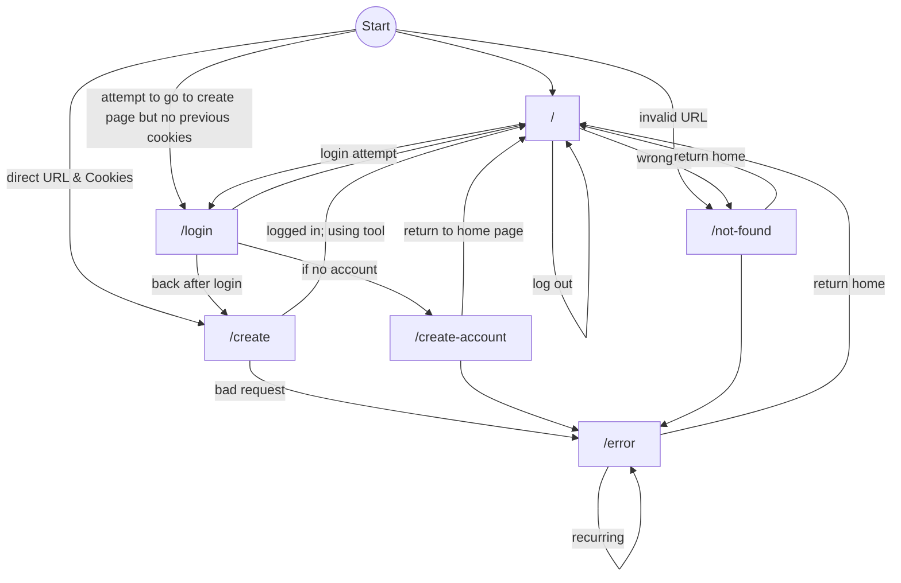
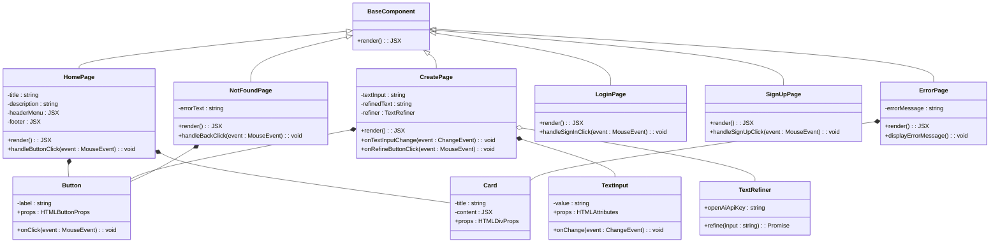

# Trace AI - Note Refining App

## Group Members

- [Nidheesh M Vakharia](https://github.com/yourgithubprofile)
- [Daniel Lee](https://github.com/d-leeee)
- [Ria Maria Mathew](https://github.com/ria0516)
- [Sabrina Piazza](https://github.com/Sabrinapiazza)
- [Maanas Kollegal](https://github.com/MaanasKollegal)

## Project Description

**Trace AI** is a smart note-taking application that helps users refine and organize their notes efficiently. The app allows users to input their rough notes in one window, while an AI-based engine works in another window to clean, format, and summarize the content for better readability and organization. This project combines the power of AI with a user-friendly interface to make the note-taking process more streamlined and effective.

### Why is it important or interesting to you?

Note-taking is a crucial skill for students and professionals alike. However, many people struggle to keep their notes organized or formatted in a way that is easy to review. With **Trace AI**, we aim to make note-taking more efficient by leveraging AI to clean and refine notes automatically, allowing users to focus on the content rather than formatting. The project is particularly interesting because it merges AI technologies with real-world applications in education and productivity. It also provides the team with hands-on experience in working with cutting-edge technologies.

### What languages/tools/technologies do you plan to use?

- **Languages**:

  - TypeScript: Ensures type safety and scalable code.

- **Frameworks**:

  - Next.js: A React-based framework with server-side rendering capabilities. This will enhance the performance of our app and improve SEO. Additionally, Next.js allows easy API creation, which is essential for our AI integration.

- **Authentication**:

  - **Clerk**: Used for user authentication and management. Clerk provides secure access to personal notes and features such as user profiles and saved preferences. It integrates well with Next.js and offers real-time capabilities.

- **Styling**:

  - Tailwind CSS: A utility-first CSS framework that will allow us to build a responsive and modern UI quickly. Its flexibility and built-in utilities will make the design process more efficient.

- **AI**:

  - **OpenAI API**: We chose OpenAI's API for natural language processing because it offers powerful, efficient, and customizable models for text refinement, summarization, and understanding. It’s highly reliable and widely recognized for its capabilities in AI.

- **UI**:

  - **ShadCN**: We have chosen ShadCN as it is a collection of high fidelity React UI components which have animations and behaviors and is a new industry standard for front end development.

- **Project Tools**:
  - GitHub for version control and collaboration.
  - GitHub Projects for task management.

### What will be the input/output of your project?

- **Input**:

  - User’s raw notes, either typed or pasted into the input window.
  - User preferences for how refined they want the output (e.g., summarized, formatted, etc.)

- **Output**:
  - A cleaner, more organized version of the input notes in the output window.

### Features of Trace AI

- Real-time note refinement using AI
- Summarization and keyword extraction
- Customizable formatting options (e.g., headers, bullet points, etc.)
- Authentication and data management using Clerk to secure user notes
- Export options for refined notes (e.g., PDF, Markdown)
- User-friendly interface with two windows: one for input and one for the AI-refined output
- Integration with popular note-taking apps (stretch goal)

## Project Complexity

The complexity of the project is appropriate for the timeline and the team size. We will be building both a user-facing interface and an AI backend, involving the integration of several technologies, including natural language processing models, secure authentication, and front-end frameworks. Each team member will be responsible for different components (e.g., frontend, backend, AI model integration), ensuring a balanced workload.

---

## Project Workflow

Every issue or task in Trace AI will pass through the following stages before deployment:

1. **Backlog**: All planned features and tasks start here. This includes ideas, suggestions, and features that are not yet prioritized for immediate work.
2. **Sprint Backlog**: Features and tasks selected for the current sprint are moved here. These are the tasks that the team has committed to work on during the sprint cycle.
3. **In Development**: Active development occurs in this stage. Once the task is being worked on, it moves from the sprint backlog to this stage.
4. **In Testing**: After development, the task is moved here for testing. This can involve unit tests, integration tests, and user acceptance tests to ensure functionality works as expected.
5. **Deployment**: Once a task or feature passes testing, it is moved to deployment, where it is released to production.

This workflow helps to ensure a structured, consistent, and high-quality development process.

---

## User Interface

### Homepage `/`

This is the site's homepage on `/`. This page will redirect the user to the `/create` page. This page also contains options to log in.

### Create Page `/create`

The Create page allows the user to use the AI assistant-driven note-taking tool. The page can only be accessed if the user has logged in.

There are also helpful tooltips scattered all accross the page in order to direct the user.

### Log In Page `/log-in`

 
This is the Log In page driven by clerk API which is our prefered backend. The page will offer options to login with Google, Github and LinkedIn.

### Create Account `/create-account`

 
This is the Create account page driven by clerk.

### 404 Page `/not-found`

This page will appear when the page being accessed doesn't exist in the web app.

### Error Page `/error`

This page appears when there is some error encountered by the AI API or any other section of the website.

---

## User Interface Flow Diagram

This section provides an overview of the User Interface (UI) flow for the application using Mermaid to visualize the navigation and routing logic. The diagram demonstrates the different paths a user can take and how the system responds under various conditions.

Below is the Mermaid code used to create the UI flow diagram:

### Diagram Overview

1. **Start Points**: The diagram begins from multiple starting conditions:

   - **Regular Start**: Directs the user to the home page (`/`).
   - **Invalid URL**: Takes the user to the "not found" page (`/not-found`).
   - **Direct URL Access with Cookies**: If the user has valid session cookies, they are taken to the `/create` page.
   - **No Previous Cookies**: If the user attempts to access `/create` but lacks authentication cookies, they are redirected to the login page (`/login`).

2. **Home Page (`/`)**:

   - Redirects to `/not-found` if a wrong URL is used.
   - Handles log-out actions and takes the user back to the home page.
   - Routes the user to the login page if a login attempt is made.

3. **Login Page (`/login`)**:

   - If the login is successful, the user is redirected to `/create`.
   - If the user doesn't have an account, they are directed to the account creation page (`/create-account`).

4. **Account Creation (`/create-account`)**:

   - On successful account creation, the user returns to the home page.

5. **Create Page (`/create`)**:

   - Redirects to an error page (`/error`) if a bad request is detected.
   - If the user is logged in and using the tool, they return to the home page.

6. **Error Handling**:
   - The `/error` page handles recurring issues by reloading itself.
   - Users can choose to return to the home page from the error page.
   - The `/not-found` page also provides an option to return to the home page.

---

## UML Class Diagram Explanation

### Explanation of Changes and SOLID Principles Applied

#### **Single Responsibility Principle (SRP)**

- **Problem**: The original design combined UI rendering and business logic within page components.
- **Solution**: Extracted the text refinement logic into a dedicated `TextRefiner` class.
  - This separation ensures that `CreatePage` handles only rendering and UI-related functionality, while `TextRefiner` handles API integration and logic.

---

#### **Open/Closed Principle (OCP)**

- **Problem**: Extending components required modifying existing classes directly.
- **Solution**: Encapsulated behavior using dependency injection.
  - For instance, `TextRefiner` is injected into `CreatePage`, making it easier to replace or extend refinement logic without altering the `CreatePage` class.

---

#### **Liskov Substitution Principle (LSP)**

- **Problem**: The `BaseComponent` didn’t fully abstract shared behavior, risking inconsistent behavior for subclasses.
- **Solution**: Standardized the `render` method across all subclasses, ensuring each can replace `BaseComponent` without unexpected behavior.

---

#### **Interface Segregation Principle (ISP)**

- **Problem**: UI components like `TextInput` and `Button` were overburdened with generic props.
- **Solution**: Clarified and minimized attributes to the specific use case.
  - `TextInput` and `Button` now implement only their respective event handlers and specific attributes.

---

#### **Dependency Inversion Principle (DIP)**

- **Problem**: High-level components were tightly coupled with low-level implementations like API calls.
- **Solution**: Abstracted API calls into the `TextRefiner` class, which is used via dependency injection.
  - This decouples `CreatePage` from the specifics of the API and allows for easier testing and replacement. 

